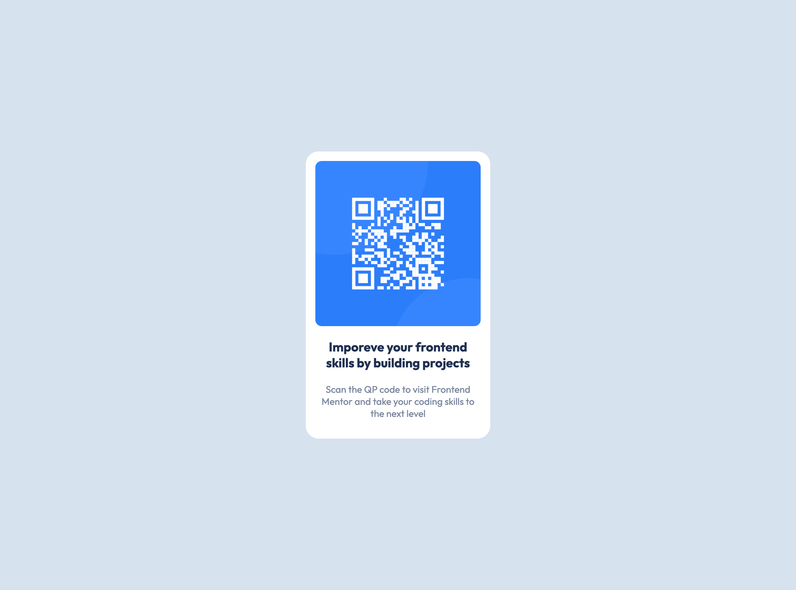

# Frontend Mentor - QR code component solution

This is a solution to the [QR code component challenge on Frontend Mentor](https://www.frontendmentor.io/challenges/qr-code-component-iux_sIO_H). Frontend Mentor challenges help you improve your coding skills by building realistic projects. 

## Table of contents

- [Overview](#overview)
  - [Screenshot](#screenshot)
  - [Links](#links)
- [My process](#my-process)
  - [Built with](#built-with)
- [Author](#author)

## Overview

### Screenshot

Small-Screen Design        |  Large-Screen Design
:-------------------------:|:-------------------------:
  |  

### Links

- Solution URL: [Frontend-Mentor--qr-code-component](https://github.com/Twixii99/Frontend-Mentor--qr-code-component)
- Live Site URL: [live-site-url](https://your-live-site-url.com)

## My process

### Built with

- Semantic HTML5 markup
- CSS custom properties
- CSS Grid

## Author

- Website - [Mahmoud Kamal](https://www.linkedin.com/in/mahmoud-kamal-120176169/)
- Frontend Mentor - [@Twixii99](https://www.frontendmentor.io/profile/Twixii99)
- Twitter - [@MkBayumi](https://twitter.com/MkBayumi)
